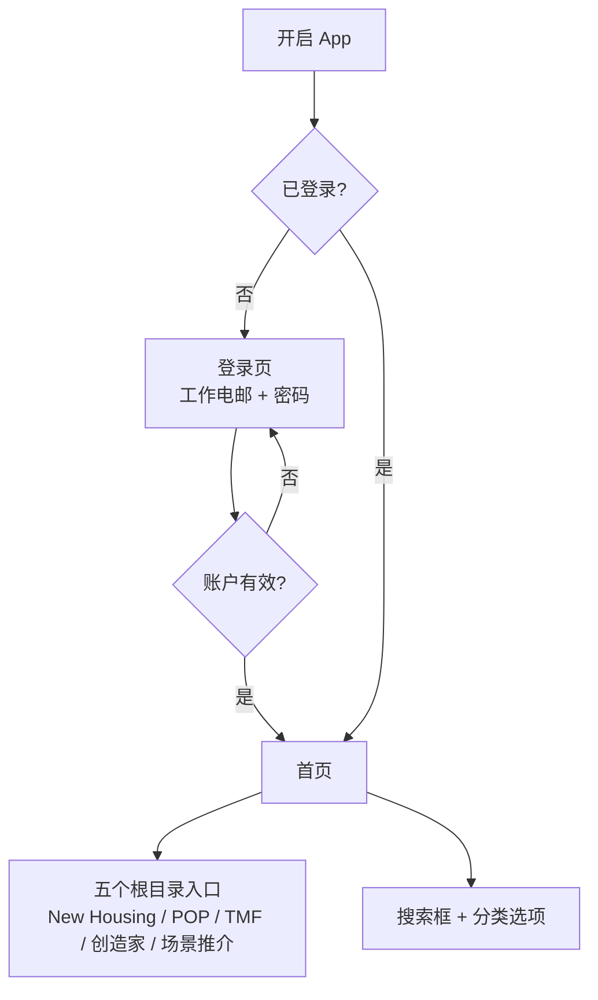
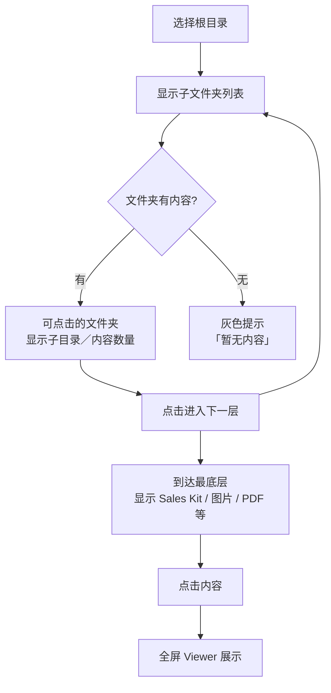
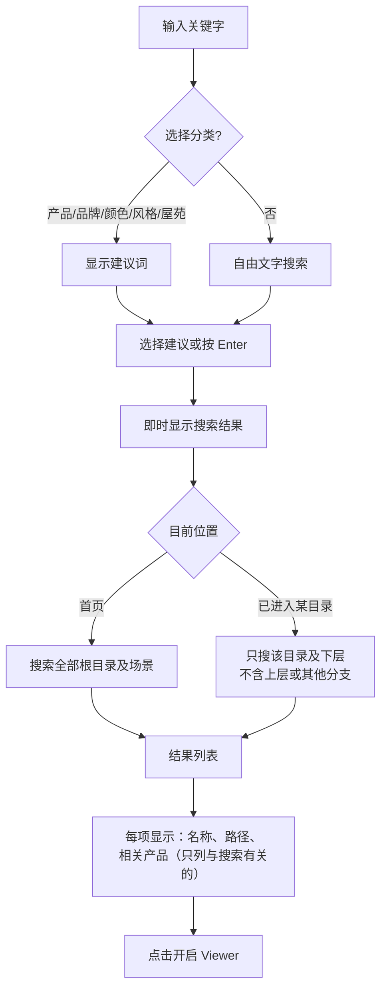
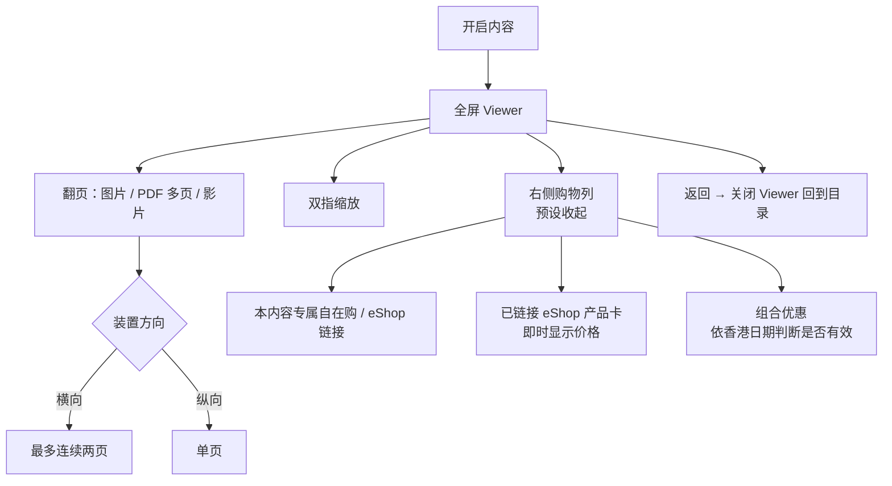
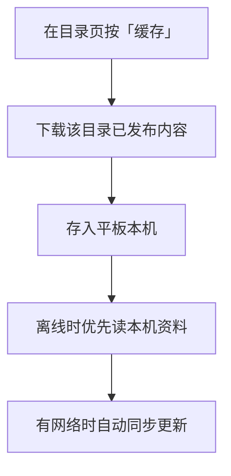
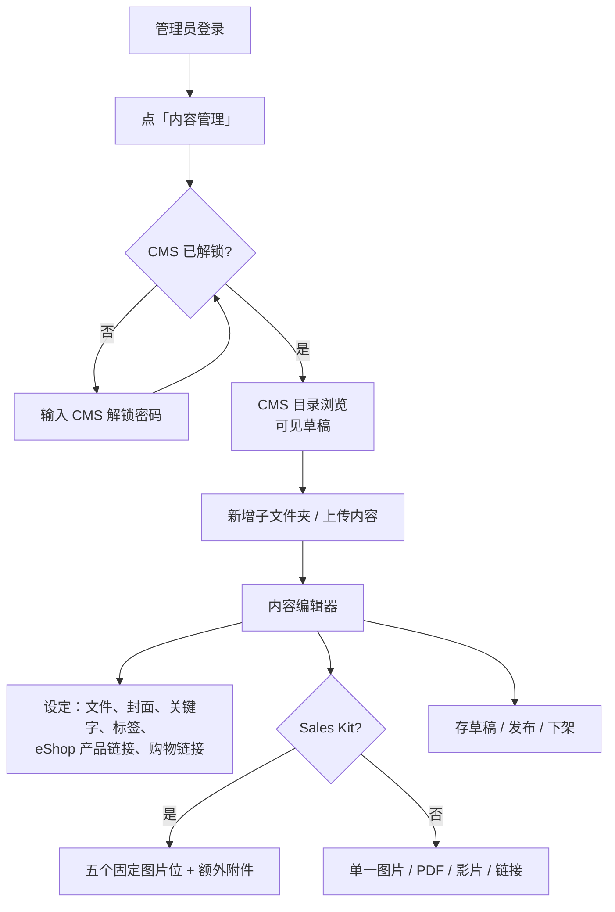

# Pricerite 前线 e-Catalog — 业务需求与 User Flow（供 IT）

> **文件用途**：由业务／内容团队整理，供 IT 理解系统功能、使用流程及安全与存取要求。  
> **系统名称**：PriceRite Frontline e-Catalog（门市电子销售目录）  
> **主要使用者**：门市前线同事（展示）、内容管理员（上传及维护资料）

---

## 1. 项目摘要

### 1.1 业务背景

门市同事在平板向客人展示销售资料，包括 Sales Kit（平面图、效果图、产品组合）、POP、场景推介等，并可链接至 Pricerite eShop／自在购查价及购买。  
内容团队通过系统内置的 **内容管理（CMS）** 上传、编辑及发布资料。

### 1.2 业务目标

| 目标 | 说明 |
|------|------|
| 前线展示 | 按屋苑／产品线浏览资料，搜索销售内容，全屏阅读图片／PDF／影片 |
| 内容管理 | 管理员上传 Sales Kit、设定 eShop 产品链接、管理草稿／发布／下架 |
| 权限隔离 | 前线只能看已发布内容；编辑须额外验证；草稿及下架素材前线不可见 |
| 离线支持 | 可将指定目录内容下载至平板，店内网络不稳时仍可展示 |

---

## 2. 用户角色

| 角色 | 谁会使用 | 可以做什么 | 不可以做什么 |
|------|----------|------------|--------------|
| **前线** | 门市销售同事 | 登录后浏览已发布目录、搜索、开启全屏展示、查看 eShop 即时价格、下载离线缓存 | 进入内容管理、上传／修改／删除内容、查看草稿或下架素材 |
| **管理员** | 内容团队／指定负责人 | 具备前线全部权限；进入 CMS 后可新增文件夹、上传内容、编辑产品链接、发布／下架 | 未通过 CMS 解锁时，不可上传、保存或读取草稿素材 |
| **未登录** | — | — | 不可浏览目录、搜索或开启任何销售素材 |
| **无授权账户** | 有登录但未被 IT 加入系统 | — | 登录失败，不可读取任何内容 |

账户以工作电邮及密码登录，由 IT 建立及停用；每位用户须指定为**前线**或**管理员**。

### CMS 第二道门

管理员登录后，若要进入「内容管理」，须再输入 **CMS 解锁密码**（与登录密码分开）。  
解锁后约 8 小时内可编辑；超时或登出后须重新解锁。

---

## 3. User Flow 与业务规则

### 3.1 前线 — 登录与首页

登出后，或一段时间无操作后，须重新登录。

### 3.2 前线 — 浏览目录

**New Housing 典型路径**：New Housing → 私楼／公居屋 → 地区 → 屋苑 → 尺数／人数 → Sales Kit。

| 规则 | 说明 |
|------|------|
| 根目录 | 固定五个：New Housing、POP、TMF、创造家、场景推介 |
| 目录结构 | 支持多层子文件夹；管理员可新增／删除（删除前须清空） |
| 导航 | 提供返回上一层及路径显示 |
| 空文件夹 | 与有内容的文件夹有明显视觉区分；有内容的排前 |
| POP | 提供 Weekly Eposter |

### 3.3 前线 — 搜索

| 规则 | 说明 |
|------|------|
| 多个关键字 | 以空格分隔，须全部符合才显示 |
| 可搜索内容 | 资料名称、关键字、标签、链接的 eShop 产品名称／品牌、目录路径、屋苑名称等 |
| 分类搜索 | 例如选「品牌」后搜 ESSENZO，只匹配品牌 |
| 产品编号 | 可手动输入搜索；产品标签及展示副标题只显示产品名称 |
| 建议词 | 从现有目录及 eShop 链接资料产生；产品建议词显示完整产品名称 |
| 搜索结果 | 有结果后收起建议词；「包含产品」只列出与搜索相关的链接产品 |
| 草稿／下架 | 前线搜索不可见 |

### 3.4 前线 — 内容展示

**Sales Kit 页序**（New Housing）：平面图 → 效果图 → 产品列表（一）→ 产品列表（二）→ 选填补充图 → 额外附件（图片／PDF／影片）。

| 规则 | 说明 |
|------|------|
| 展示 | 全屏；按返回关闭并回到目录 |
| PDF | 可逐页翻阅；横向最多两页、纵向单页 |
| 购物列 | 预设收起；开启时不重置目前页码 |
| eShop 价格 | 从 Pricerite 官网即时读取 |
| 产品链接 | 只使用 Pricerite 官网产品链接 |
| 组合优惠 | 依香港时区日期判断是否在有效期内 |

### 3.5 前线 — 离线缓存

只可缓存已发布内容；只缓存系统内素材。

### 3.6 管理员 — 内容管理（CMS）

| 规则 | 说明 |
|------|------|
| 上传位置 | 只能上传至「目前文件夹及下层」，不可跨分支 |
| 内容类型 | 图片、PDF、影片、外部网站链接 |
| 内容状态 | 草稿、已发布、已下架；前线只见已发布 |
| Sales Kit | 5 个固定图片位 + 额外附件；发布时头 4 张图为必填 |
| 内容设定 | 名称、封面、关键字、标签、显示次序 |
| 产品链接 | 每份内容可链接多个 eShop 产品（显示名称、品牌及即时价格） |
| 购物链接 | 每份内容可设定独立的自在购链接及 eShop 链接（与产品卡分开） |
| 上传限制 | 单档上限 50 MB；接受图片、PDF、影片等指定格式 |

**管理面板**（与目录并列）：

- **产品索引**：产品名称、品牌、颜色、风格、链接
- **场景推介**：六个场景；可设定名称、图片、eShop 链接、启用状态；URL 未设定时显示「链接待设定」且不可点击；停用的场景不出现在前线
- **组合优惠**：优惠名称、图片、链接、香港时区起止日期

---

## 4. 安全与存取控制

### 4.1 登录与角色

| 要求 | 说明 |
|------|------|
| 强制登录 | 未登录不可浏览目录、搜索或开启任何销售素材 |
| 角色分离 | 前线只读已发布内容；管理员可进入 CMS（须解锁） |
| 账户管理 | 由 IT 建立及停用账户；人员调动时及时调整角色 |
| 无授权拒绝 | 未被加入系统的账户，一律拒绝存取 |
| CMS 第二道门 | 管理员编辑内容前须输入 CMS 解锁密码；超时须重新验证 |
| 登出 | 登出后须清除登录状态及 CMS 解锁状态 |

### 4.2 网络与 IP 存取

| 要求 | 说明 |
|------|------|
| 内部使用 | 系统供内部门市使用；须限制未授权人士存取 |
| IP／网络限制 | 按公司政策设定存取来源，例如公司 VPN、门市网络或指定 IP 范围 |

### 4.3 内容与素材保护

| 要求 | 说明 |
|------|------|
| 发布状态隔离 | 草稿及下架素材，前线不可通过浏览或搜索读取 |
| 素材存取 | 销售图片／PDF／影片须登录后由系统提供 |
| 上传权限 | 通过 CMS 解锁的管理员可上传及修改 |

### 4.4 共用装置与离线资料

| 要求 | 说明 |
|------|------|
| 共用平板 | 门市平板可能多人共用；离开后应清除浏览资料 |
| 离线缓存 | 下载缓存会把已发布素材存于平板本机 |
| 资料保存 | 内容及账户资料不可因系统故障而遗失 |

---

## 5. 使用环境

| 项目 | 说明 |
|------|------|
| 主要装置 | 门市平板（iPad／Android） |
| 屏幕方向 | 支持横向及纵向 |
| 语言 | 界面使用繁体中文（香港） |
| 网络 | 平时连网读取最新内容及 eShop 价格；离线缓存可于无网时展示已下载资料 |
